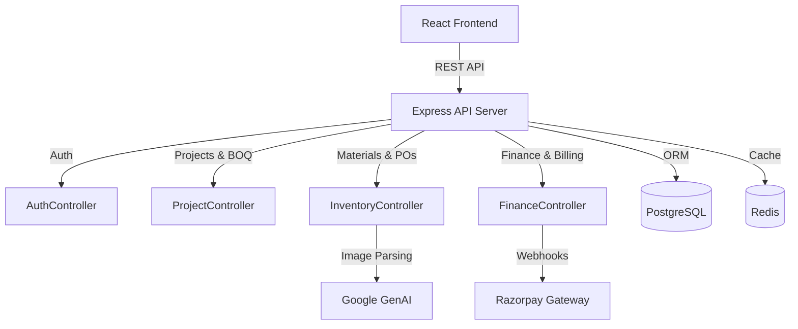

# BuildFlow — Construction Project & Contractor Management Platform

BuildFlow is a production-quality full-stack B2B web application designed for small and mid-sized construction contractors. It provides a central dashboard to manage projects, BOQs, materials, labour, vendors, expenses, client billing, payments, and profitability.

## Features
- **Project Management**: Track active projects, contract values, and status.
- **BOQ & Materials**: Maintain Bill of Quantities, inventory stock, minimum thresholds, and POs.
- **Labour & Attendance**: Track daily attendance and calculate daily wages.
- **Expenses**: Log material, equipment, and miscellaneous expenses.
- **Invoicing & Payments**: Generate RA bills, integrate with Razorpay for payment collection, and automatically track cash flow.
- **Daily Reports (AI)**: Engineers can upload daily site reports, which are automatically parsed by Gemini AI to extract workforce counts and materials used.
- **Analytics & Profitability**: See real-time calculated margins (Estimated vs. Actual Cost vs. Revenue).

## Architecture

This application follows a **Clean Modular Monolith** architecture.
- **Frontend**: React + Vite + TailwindCSS + React Router.
- **Backend**: Node.js + Express + TypeScript.
- **Database**: PostgreSQL (managed via Prisma ORM) and Redis.



## Running Locally

### Prerequisites
- Node.js v18+
- Docker & Docker Compose (for PostgreSQL and Redis)
- A `.env` file with `DATABASE_URL`, `JWT_SECRET`, `RAZORPAY_KEY_ID`, and `GEMINI_API_KEY`.

### Steps
1. Start the database containers:
   ```bash
   docker-compose up -d
   ```
2. Navigate to the backend and install dependencies:
   ```bash
   cd backend
   npm install
   npx prisma db push
   npx prisma generate
   ```
3. Seed the database with sample data:
   ```bash
   npx ts-node prisma/seed.ts
   ```
4. Start the backend development server:
   ```bash
   npm run dev
   ```
5. In a new terminal, start the frontend:
   ```bash
   cd frontend
   npm install
   npm run dev
   ```
